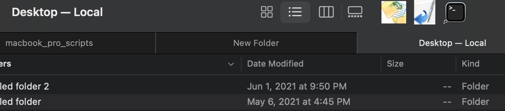
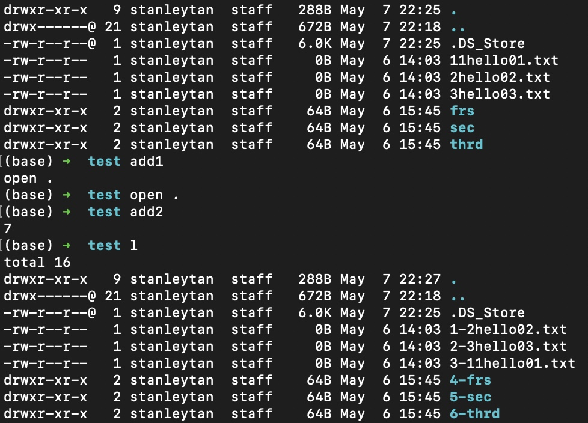
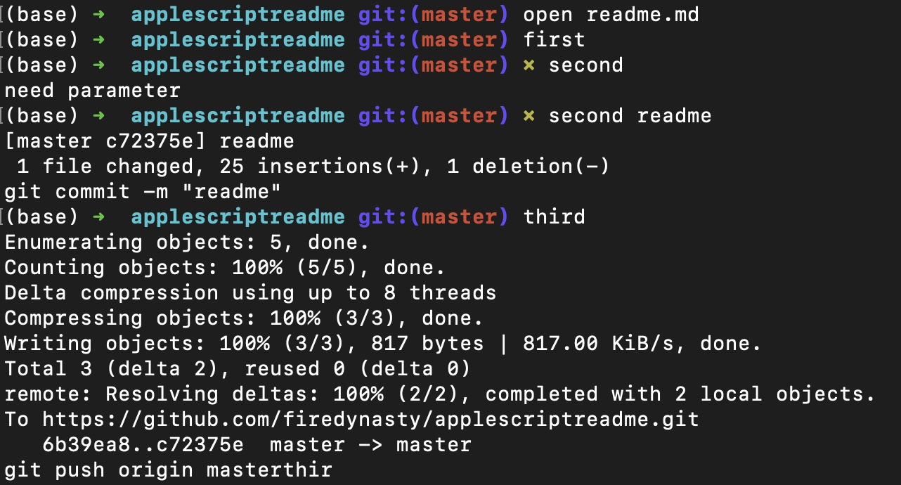

# applescriptreadme


These are the tools I use offline. 

HTML file and .scpt file

Hope you find some of this code handy!  

Copy_to_icloud.scpt : this is a droplet that allows you to directly copy that dropped file to icloud.  Using Terminal to do so. 

* 1\. [droplet icloud](#droplet-icloud)
    * 1.1\. text delimiters
    * 1.2\. copy to dropbox
* 2\. [using_droplets](#using-droplets)
* 3\. [rename files](#rename-files)
* 4\. [quotations](#quotations)
	* 3.1 the problem with ' ', " ", and quotes inside
* 5\. [Terminal Scripting](#terminal-scripting)
	* 4.1\. [Pwd](#piping-pwd-from-terminal)
* 6\. [Controlling keystrokes](#controlling-key-strokes)
* 7\. [Finder Applet](#finder-applet)
* 8\. [.jpg control](#click-on-jpg-files-to-open-slideshow)
* 9\. [interesting question](#interesting-question)
* 10\. [zshrc git scripting](#git-scripting)
* 11\. [progression](#progression)
* 12\. [convert_multiple_files](#convert-multiple-files)
* 13\. [blocking and trading files](#trade-block-files)
* 14\. [delimiter and looping array](#delimiter-and-looping-array)
* 15\. [might improve](#might-improve)
* 16\. [resource](#resource)
* 17\. [writing to files](#writing-to-files)


# Droplet icloud

```applescript

on open Dropped_File
	tell application "Finder"
		--what I want to do is get the path, cd there
		--then python the name of the file there
		set strFolder to POSIX path of Dropped_File
		set textNumber1 to characters 1 thru -((offset of "/" in (reverse of items of strFolder as string)) + 1) of strFolder as string
		
		----
		
		set freedom to text item -1 of strFolder
		
		--set fileName to item of fileAlias
	end tell
	set text item delimiters to "/"
	tell application "Finder"
		--what I want to do is get the path, cd there
		--then python the name of the file there
		
		
		set freedom to text item -1 of strFolder
		
		--set fileName to item of fileAlias
	end tell
	tell application "Terminal"
		
		activate
		delay 1
		do script "cd " & textNumber1 in front window
		delay 1
		do script "cp " & freedom & " ~/iCloud" in front window
		-- requires sym link change
		-- https://michaelsoolee.com/icloud-drive-symlink/
		
		
	end tell
end open
```

# Using Droplets

Here I am able to drop a file and it gets moved to the open Terminal window




```applescript

on open these_items
	repeat with i from 1 to the count of these_items
		set this_item to item i of these_items
		tell application "Terminal"
			activate
			-- If there are no open windows, open one.
			if (count of windows) is less than 1 then
				do script ""
			end if
			set theTab to selected tab in first window
			set filePath to POSIX path of this_item
			set textNumber1 to characters 1 thru -((offset of "/" in (reverse of items of filePath as string)) + 1) of filePath as string
			set textNumber2 to name of (info for filePath)
			set textNumber3 to textNumber1 & "/" & textNumber2
			set textNumber4 to (the clipboard)
			if textNumber2 contains "." then
				do script "mv " & quoted form of textNumber3 & "  ." in theTab
				--do script "cd " & textNumber4 in theTab
				delay 0.5
				do script ":" in theTab
			else
				do script "mv " & quoted form of textNumber1 & "  ." in theTab
				--do script "cd " & textNumber4 in theTab
				delay 0.5
				do script ":" in theTab
			end if
		end tell
	end repeat
	
end open

```


To drop any file from the folder to a icon on the toolbar to get to that folder in Terminal:


```applescript


on open theFiles
	tell application "Terminal"
		activate
		-- If there are no open windows, open one.
		if (count of windows) is less than 1 then
			do script ""
		end if
		set theTab to selected tab in first window
		set filePath to POSIX path of item 1 of theFiles
		set textNumber1 to characters 1 thru -((offset of "/" in (reverse of items of filePath as string)) + 1) of filePath as string
		set textNumber2 to name of (info for filePath)
		do script "cd " & quoted form of textNumber1 in theTab
	end tell
	return
end open

on run
	--  Handle the case where the script is launched without any dropped files
	open (choose file with multiple selections allowed)
	return
end run

```


Here I am able to create a file called back.asc, which when clicked will go back one folder

```applescript

tell application "Finder"
	try
		set fileName to "_back"
		--set fileName to the text returned of result
		if length of fileName = 0 then
			return 0
		end if
		set fileExt to ".asc"
		set thisFolder to the target of the front window as alias
		set newFile to fileName & fileExt
		
		make new file at thisFolder with properties {name:newFile, file type:"TEXT", creator type:"ttxt"}
	on error errMsg
		display dialog (errMsg)
	end try
end tell

```

Need to go to 'get info' (right click) to open all .asc files 


```applescript

on open theFiles
	tell application "Terminal"
		activate
		-- If there are no open windows, open one.
		if (count of windows) is less than 1 then
			do script ""
		end if
		set theTab to selected tab in first window
		-- changed window 1 to theTab
		set filePath to POSIX path of item 1 of theFiles
		set textNumber1 to characters 1 thru -((offset of "/" in (reverse of items of filePath as string)) + 1) of filePath as string
		set textNumber2 to name of (info for filePath)
		if textNumber2 contains "com" then
			delay 0.2
			do script "q" in window 1
			delay 0.2
			do script "cd " & quoted form of textNumber1 in window 1
			delay 0.2
			do script "cat " & quoted form of filePath & " | pbcopy" in window 1
			delay 1.5
			do script "open -a \"Google Chrome\" " & (the clipboard) in window 1
			return
			
		else if textNumber2 contains "back" then
			tell application "System Events"
				tell process "Finder"
					set frontmost to true
					click menu item "Back" of menu "Go" of menu bar 1
				end tell
			end tell
			return
			
		else
			delay 0.2
			do script "q" in window 1
			delay 0.2
			do script "cd " & quoted form of textNumber1 in window 1
			delay 0.2
			do script "900" in window 1
			delay 0.2
			do script "cat " & quoted form of filePath & " |more" in window 1
			return
		end if
	end tell
	return
end open

on run
	--  Handle the case where the script is launched without any dropped files
	open (choose file with multiple selections allowed)
	return
end run

```


# Rename Files

What this does here: Adding prefixes

 https://apple.stackexchange.com/questions/402734/applescript-to-rename-file-names




Scripting out of terminal:

```
osascript -e "tell application \"Finder\" to set target of Finder window 1 to POSIX file \"`pwd`\""

```
### Quotations

Quotations are really important.  For osascript, it can cause issues if the order of the quotations is incorrect.  ie ' ' then "" inside , but if " is escaped with \ then need to use " " for outside. 

In a .scpt file to be made into an .app file
do script "osascript -e \"tell application \\\"Finder\\\" to activate\"" in theTab
delay 0.2
	
do script "osascript -e \"tell application \\\"System Events\\\" to key code 9 using {command down}\" ;osascript -e \"tell application \\\"System Events\\\" to key code 36\"" in theTab


do script "find . -type d -exec sh -c \"find \\\"{}\\\" -maxdepth 1 -type f -iname \\\"*.png\\\" -o -iname \\\"*.jpg\\\" ! -iname \\\"*.DS_Store\\\" | sort | head -n 1\" \";\" > /Users/stanleytan/desktop/macbook_pro_scripts/findhelp_txt/secondary_test.txt" in window 1 

in applescript


Quotations in applescript to be used by an applet

https://stackoverflow.com/questions/14737414/using-double-quotes-in-applescript-command-do-shell-script-echo

Hierarchy of Quotes:  " to \" to \\\"

osascript -e "tell application \"Finder\" to activate"
osascript -e "tell application \"System Events\" to key code 8"


## Terminal Scripting

### Piping pwd from Terminal

Piping pwd from terminal to Finder: 

https://apple.stackexchange.com/questions/349348/opening-a-new-finder-tab-from-command-line/420363#420363


Google: "POSIX file "`pwd`" mac"

Proper syntax for "alias"-ing in "osascript"

https://arstechnica.com/civis/viewtopic.php?f=19&t=176389


Bash scripting :

To get the pwd path and put it into the clipboard with quotes:


alias pwdcopy="pwd |sed \"s/^/\\\"/;s/$/\\\"/\" |pbcopy"

--------------------------------


## Get the path of the front window

"How To Get Path to Finder Folder or Target of Window"

https://forum.latenightsw.com/t/how-to-get-path-to-finder-folder-or-target-of-window/1228

tell application "Finder" to set filePath to POSIX path of (target of front window as text)


## Controlling Key Strokes


alias target.='cat ~/desktop/script.txt | pbcopy;osascript -e "tell application \"System Events\" to key code 9 using {command down}";osascript -e "tell application \"System Events\" to key code 36"; osascript -e "tell application \"Finder\" to activate"'

controlling key strokes and scripts


# Finder Applet

Creating an applet then using that to open every .txt in Terminal and changing to that directory in Terminal

finder_scripting/cat_file_from_terminal.scpt

https://apple.stackexchange.com/questions/212813/open-text-file-from-finder-in-vim

Usecase: open .txt files in the terminal

--------------------------------

# Zshrc Bash Functions

opening new tab in finder window:

https://scriptingosx.com/2020/03/macos-shell-command-to-create-a-new-terminal-window/


alias alias1='osascript -e "tell application \"Terminal\" to do script \"900\"";osascript -e "tell application \"Terminal\" to do script \"vim ~/desktop/work_.txt\" in window 1"' 

Here 900 is a window size setting, then opening a file into a new Tab 


https://apple.stackexchange.com/questions/300156/terminal-opens-new-tab-instead-of-new-window-with-command-n

```

function new() {
    if [[ $# -eq 0 ]]; then
        open -a "Terminal" "$PWD"
    else
        open -a "Terminal" "$@"
    fi
}

```

> new documents 
// this will open a new window in the Terminal pointing to the folder documents of that directory

> new
// without the parameter will open a new window in the same directory

https://stackoverflow.com/questions/34340575/zsh-alias-with-parameter


# Click on .jpg files to open slideshow


```applescript

on open theFiles
	tell application "Terminal"
		activate
		-- If there are no open windows, open one.
		if (count of windows) is less than 1 then
			do script ""
		end if
		set theTab to selected tab in first window
		-- changed window 1 to theTab
		set filePath to POSIX path of item 1 of theFiles
		set textNumber1 to characters 1 thru -((offset of "/" in (reverse of items of filePath as string)) + 1) of filePath as string
		set textNumber2 to name of (info for filePath)
		delay 0.2
		do script "cd " & quoted form of textNumber1 in window 1
		delay 0.2
		do script "open -a \"Preview\" " & quoted form of textNumber1 in window 1
		delay 0.2
	end tell
	delay 3
	tell application "System Events"
		tell process "Preview"
			set frontmost to true
			click menu item "Slideshow" of menu "View" of menu bar 1
		end tell
	end tell
	return
end open

on run
	--  Handle the case where the script is launched without any dropped files
	open (choose file with multiple selections allowed)
	return
end run

```

Set this script as app and choose to run when opening .jpg files.  This will let you do slideshows of all the files in the same directory as the file that is opened.  

# Interesting Question

So I wanted to count from 10-20 and then 20-30 because on Terminal when I list the files they have a weird way of displaying.  If I have prefixes of 1- , 2-, 3-, 4- the 10's are displayed before 3-.  So, how do I rename files from 10-20 or 20-30 and when I googled it, Google said it didn't have a good answer for me.  Actually, the answer is to start the count from 10.

```applescript

tell application "Finder"
	set source_folder to (folder of the front window)
	set folderContents to every item of source_folder as list
	set sortedContents to (sort folderContents by name)
	set count_1 to 10
	repeat with theFile in sortedContents
		set oldName to name of theFile
		set stringed to count_1 as string
		set name of theFile to stringed & "-" & oldName
		set count_1 to count_1 + 1
	end repeat
end tell

-- renames all files in a folder by adding a prefix starting from the number 10.

```


# Git Scripting

```bash

alias first='git add .'
alias third='git push origin master;echo "git push origin master"thir'
alias fourth='git push origin main;echo "git push origin main"'
function second() {
     if [[ $# -eq 0 ]]; then
        echo 'need parameter'
    else
    git commit -m "$@"
    echo "git commit -m \"$@\""
    fi
}

```

Instead of git add . I use first , and so on:




# progression

```applescript

		delay 0.2
			do script ""
			delay 0.2
			do script "cd " & quoted form of textNumber1 in window 1
			delay 0.2
			do script "900" in window 1
			delay 0.2
			do script "cat " & quoted form of filePath & " | pbcopy" in window 1
			delay 1.5
			do script "osascript -e \"tell application \\\"System Events\\\" to key code 9 using {command down}\" ;osascript -e \"tell application \\\"System Events\\\" to key code 36\"" in window 1

```

No longer need this: right click open a file to have a tree displayed in the Terminal

# convert multiple files


This is in droplet form

```applescript

on open these_items
	repeat with i from 1 to the count of these_items
		set this_item to item i of these_items
		tell application "Finder"
			set theFilesFolder to (folder of this_item) as text
		end tell
		
		tell application "Pages"
			set theDoc to open this_item
			
			set theDocName to name of theDoc
			set theName to (characters 1 thru -7 of theDocName) as text
			export theDoc as PDF to file ((theFilesFolder & theDocName & ".pdf") as text)
			
			close theDoc
			
		end tell
	end repeat
end open


```


This is in workflow mode:

*choose ask for finder items, allow for multiple selection

```applescript


on run {input, parameters}
	
	repeat with i from 1 to the count of input
		set this_item to item i of input
		tell application "Finder"
			set theFilesFolder to (folder of this_item) as text
		end tell
		
		tell application "Pages"
			set theDoc to open this_item
			
			set theDocName to name of theDoc
			set theName to (characters 1 thru -7 of theDocName) as text
			export theDoc as PDF to file ((theFilesFolder & theDocName & ".pdf") as text)
			
			close theDoc
			
		end tell
	end repeat
	
	return input
end run

```


# trade block files

block a file in terminal.  in the next tab, write trade and the file will be transfered to the folder in that tab. 


```zshrc

alias block1="osascript ~/desktop/block_/block1.scpt"


function block() {
    if [[ $# -eq 0 ]]; then
        echo 'need parameter'
    else
        cat /dev/null > /Users/test.txt
        block1        
        echo /$@ >> /Users/test.txt

    fi
}

alias trade="osascript ~/desktop/block_/block3.scpt"

````


```applescript 

for block1.scpt:

tell application "Terminal"
	set theTab to selected tab in first window
	do script "cat /dev/null > /Users/test_2.txt" in theTab
	do script "pwd >> /Users/test_2.txt" in theTab
	delay 1
end tell

```


```applescript

for block3.scpt


set newFile to ("Macintosh HD:Users:test_2.txt")
set theFileContents to paragraphs of (read file newFile)
set first_ to item 1 of theFileContents
set newFile_2 to ("Macintosh HD:Users:test.txt")
set theFileContents_2 to paragraphs of (read file newFile_2)
set first_1 to item 1 of theFileContents_2
set combined_ to first_ & first_1
delay 1
tell application "Terminal"
	set theTab to selected tab in first window
	
	do script "mv " & combined_ & " ." in theTab
end tell


set newFile to ("Macintosh HD:Users:stanleytan:Desktop:macbook_pro_scripts:echo_files:test_2.txt")
set theFileContents to paragraphs of (read file newFile)
set first_ to item 1 of theFileContents
set newFile_2 to ("Macintosh HD:Users:stanleytan:Desktop:macbook_pro_scripts:echo_files:test.txt")
set theFileContents_2 to paragraphs of (read file newFile_2)
set first_1 to item 1 of theFileContents_2
set combined_ to first_ & first_1
delay 1
tell application "Terminal"
	set theTab to selected tab in first window
	
	do script "mv " & quoted form of combined_ & " ." in theTab
end tell


```


# delimiter and looping array

```applescript


set myTestString to (the clipboard)

set myArray to my theSplit(myTestString, ";")

on theSplit(theString, theDelimiter)
	-- save delimiters to restore old settings
	set oldDelimiters to AppleScript's text item delimiters
	-- set delimiters to delimiter to be used
	set AppleScript's text item delimiters to theDelimiter
	-- create the array
	set theArray to every text item of theString
	-- restore the old setting
	set AppleScript's text item delimiters to oldDelimiters
	-- return the result
	return theArray
end theSplit

repeat with theItem in myArray
	tell application "Terminal"
		do script "open -a \"Google Chrome\" " & theItem in window 1
		delay 2
	end tell
end repeat


-- a more condensed usable function 

set myTestString to (the clipboard)


set oldDelimiters to AppleScript's text item delimiters
set AppleScript's text item delimiters to ";"
set myArray to every text item of myTestString
set AppleScript's text item delimiters to oldDelimiters

return myArray

https://erikslab.com/2007/08/31/applescript-how-to-split-a-string/

https://alvinalexander.com/apple/applescript-list-iterate-items-for-loop-mac/\


using this with bash

on open theFiles
	tell application "Terminal"
		activate
		-- If there are no open windows, open one.
		if (count of windows) is less than 1 then
			do script ""
		end if
		set theTab to selected tab in first window
		-- changed window 1 to theTab
		set filePath to POSIX path of item 1 of theFiles
		set textNumber1 to characters 1 thru -((offset of "/" in (reverse of items of filePath as string)) + 1) of filePath as string
		set textNumber2 to name of (info for filePath)
		if textNumber2 contains "local" then
			delay 0.2
			do script "vim " & quoted form of filePath in window 1
			delay 0.2
			do script "/Users" in window 1
			delay 0.5
			do script "yy" in window 1
			delay 0.5
			do script ":q" in window 1
			delay 0.5
			set myTestString to (the clipboard)
			
			set oldDelimiters to AppleScript's text item delimiters
			set AppleScript's text item delimiters to ";"
			set myArray to every text item of myTestString
			set AppleScript's text item delimiters to oldDelimiters
			
			repeat with theItem in myArray
				tell application "Terminal"
					do script "u" & theItem in window 1
					delay 2
				end tell
			end repeat
			return
		else
			delay 0.2
			do script "vim " & quoted form of filePath in window 1
			delay 0.2
			do script "/https" in window 1
			delay 0.5
			do script "yy" in window 1
			delay 0.5
			do script ":q" in window 1
			delay 0.5
			set myTestString to (the clipboard)
			
			set oldDelimiters to AppleScript's text item delimiters
			set AppleScript's text item delimiters to ";"
			set myArray to every text item of myTestString
			set AppleScript's text item delimiters to oldDelimiters
			
			repeat with theItem in myArray
				tell application "Terminal"
					do script "open -a \"Google Chrome\" " & theItem in window 1
					delay 2
				end tell
			end repeat
			return
		end if
		
	end tell
	return
end open

on run
	--  Handle the case where the script is launched without any dropped files
	open (choose file with multiple selections allowed)
	return
end run
```

# might improve 


```applescript

looping a split list to create new variables for each

https://stackoverflow.com/questions/51395110/split-query-into-two-arguments-using-delimiter-space-applescript


```

# resource

https://gist.github.com/nayanseth/c18931e0777579467a12


Removing Trailing White Spaces ..


https://macscripter.net/viewtopic.php?id=14746

# writing to files

```applescript
set this_story to "Once upon a time in Silicon Valley...not"
set theFile to POSIX file "/Users/username/Desktop/macbook_pro_scripts/echo_files/open_test.txt"


-- Open the file for writing
set theOpenedFile to open for access file theFile with write permission

-- Clear the file if content should be overwritten
set eof of theOpenedFile to 0

-- Write the new content to the file
write this_story to theOpenedFile starting at eof

-- Close the file
close access theFile
-- Return a boolean indicating that writing was successful
```


https://developer.apple.com/library/archive/documentation/LanguagesUtilities/Conceptual/MacAutomationScriptingGuide/ReadandWriteFiles.html

https://developer.apple.com/library/archive/documentation/LanguagesUtilities/Conceptual/MacAutomationScriptingGuide/ReferenceFilesandFolders.html


# creating verification to continue with script

https://www.dropbox.com/s/sli3wg49cdt0sy5/1-set_as_number.jpg?dl=0

